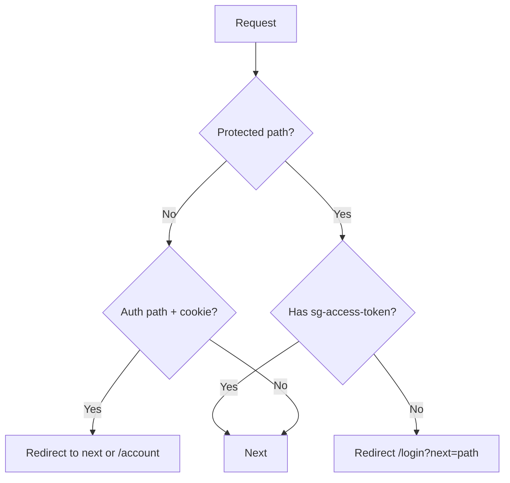
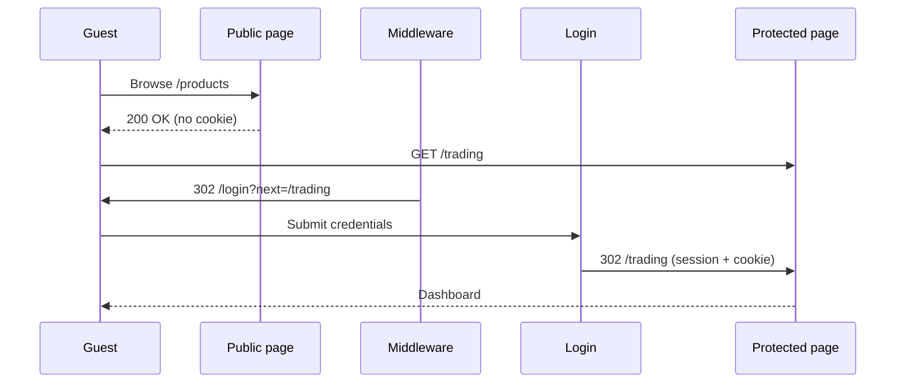

# Authentication & Routing Architecture

## Principles

1. **Guest-first** — catalog, content, and live prices are public (SEO-indexable).
2. **Protect by route** — middleware runs only on auth + protected path prefixes.
3. **No global auth wall** — public pages never mount `AuthGuard`.
4. **Return URL** — `?next=` preserved with open-redirect protection (`getSafeRedirectPath`).

## Route map

| URL prefix | Access | Route group |
|------------|--------|-------------|
| `/`, `/products`, `/blog`, `/prices`, … | Public | `(public)` |
| `/login`, `/login/verify` | Auth (guest) | `(auth)` |
| `/account`, `/trading`, `/checkout`, … | Protected | `(protected)` |

Canonical lists live in `apps/web/src/shared/routing/routes.config.ts`.

## Folder structure

```
apps/web/src/
├── middleware.ts                 # Edge: cookie check on protected/auth only
├── shared/routing/
│   ├── routes.config.ts          # PUBLIC / PROTECTED / AUTH prefixes
│   ├── path-matcher.ts
│   └── safe-redirect.ts
├── app/
│   ├── layout.tsx                # Root shell (header, providers)
│   ├── (public)/                 # SEO, guest browsing
│   │   ├── page.tsx              # Home → /
│   │   ├── products/
│   │   ├── blog/
│   │   ├── prices/
│   │   └── …
│   ├── (auth)/
│   │   └── login/
│   └── (protected)/              # noindex metadata
│       ├── layout.tsx            # ProtectedShell (client expiry)
│       ├── account/
│       ├── trading/
│       ├── wallet/
│       └── …
└── features/auth/
    ├── components/
    │   ├── protected-shell.tsx
    │   └── require-auth-action.tsx  # Add to cart, etc.
    └── hooks/use-auth.ts
```

## Middleware strategy



**Matcher** — only protected + login segments (not `/products`, `/blog`, etc.) for performance.

## Authentication flow



## Client layers

| Layer | Responsibility |
|-------|----------------|
| Middleware | Initial gate; cookie `sg-access-token` |
| `(protected)/layout` | `ProtectedShell` if session cleared client-side |
| `RequireAuthAction` | Buttons on public pages (add to cart) |
| Axios interceptor | Refresh token; else clear session |

## SEO

- `(public)/layout` → `robots: index, follow`
- `(protected)/layout` → `robots: noindex`
- Product/blog pages use `generateMetadata` where applicable

## Adding a new route

1. Add prefix to `PROTECTED_ROUTE_PREFIXES` or ensure it is covered by `PUBLIC_ROUTE_PREFIXES`.
2. Add segment to `middleware.ts` `config.matcher` if protected.
3. Place page under `(public)`, `(auth)`, or `(protected)`.
