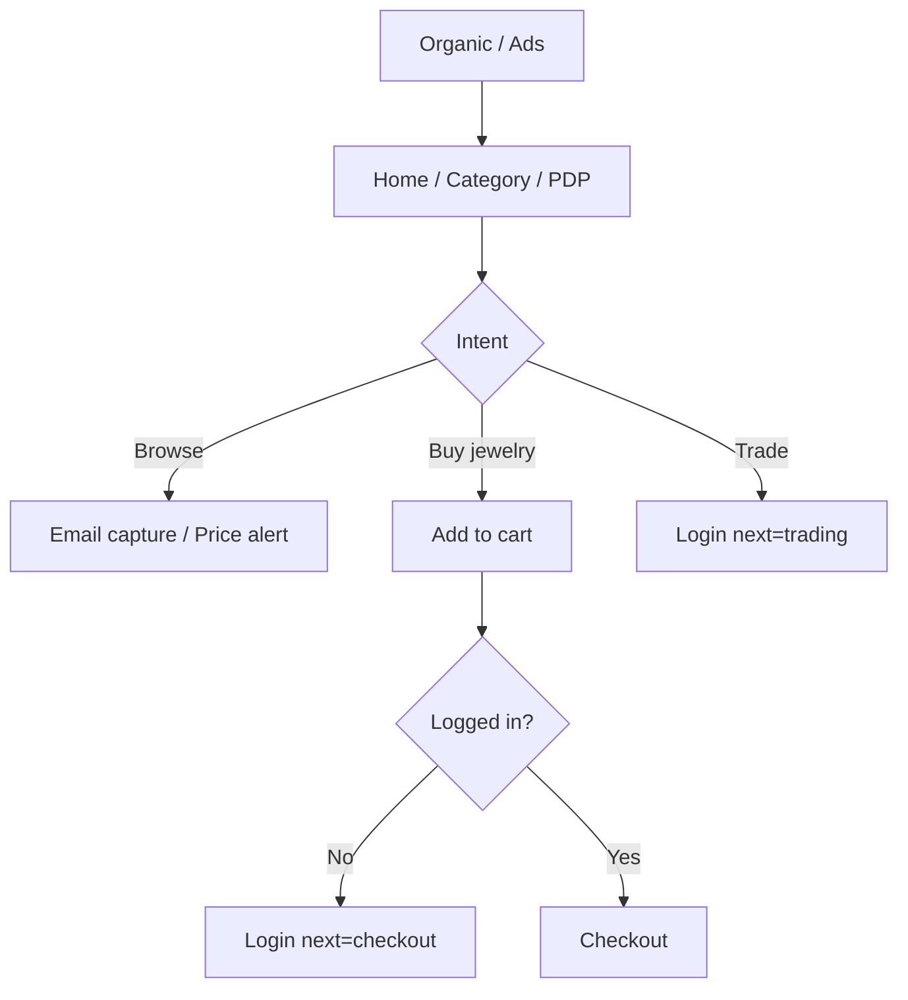

# Talashim — Public Storefront Information Architecture

Luxury gold e-commerce + trading platform (Persian-first, RTL).  
**Guest-first:** all pages below are public unless noted. Checkout/trading require login ([AUTH_ROUTING.md](./AUTH_ROUTING.md)).

---

## 1. Strategic goals

| Goal | IA response |
|------|-------------|
| Trust & transparency | Live price strip, ojrat/tax breakdown on PDP, assay & SKU visible |
| Luxury minimalism | Few top-level nav items; whitespace; gold/zinc palette |
| SEO | Indexable PLP/PDP/blog; `generateMetadata`; structured data (Product, BreadcrumbList) |
| Speed | RSC for catalog; edge cache on prices; optimized images |
| Conversion | Sticky CTA on PDP; guest cart → login at checkout; price alert hooks |

---

## 2. Site map (page hierarchy)

```
talashim.com/
│
├── /                          [L0] Home
├── /prices                    [L0] Live gold prices (public API)
│
├── /products                  [L1] Catalog hub (PLP — all types)
│   └── ?type=&category=&sort=&page=
├── /categories                [L1] Category index
│   └── /categories/{slug}     [L2] Category PLP (SEO landing)
├── /products/{slug}           [L2] Product detail (PDP)
├── /search                    [L1] Search results (?q=)
│
├── /blog                      [L1] Magazine index
│   └── /blog/{slug}           [L2] Article (SEO)
│
├── /about                     [L1] Brand story
├── /contact                   [L1] Contact & showrooms
├── /faq                       [L1] FAQ (accordion, FAQ schema)
├── /terms                     [L1] Terms of service
├── /policies                  [L1] Privacy & policies
│
├── /login                     [Auth] Login (not indexed)
└── /login/verify              [Auth] OTP verify
```

**Protected (not part of public IA):** `/account`, `/trading`, `/checkout`, `/wallet`, `/wholesale`, `/b2b` — linked from CTAs only.

---

## 3. Page specifications

### 3.1 Home `/`

| Zone | Content | Data source |
|------|---------|-------------|
| Hero | Value prop, dual CTA (Shop / Live price) | Static + CMS later |
| Live ticker | Buy/sell per gram, 18/24 ayar | `GET /pricing/live` |
| Featured | 4–8 hero SKUs | `GET /catalog/featured` |
| Categories | 6–8 tiles → category PLP | `storefront-ia.ts` |
| Trust | Certificates, insured delivery, support | Static |
| Editorial | 1 paragraph brand | Static |
| Magazine | 3 latest posts | `GET /blog` |
| CTA band | “Trade gold” → `/trading` (login) | — |

**SEO:** `title`, `description`, `WebSite` + `Organization` JSON-LD.

---

### 3.2 Live gold prices `/prices`

| Zone | Content |
|------|---------|
| Spot cards | Per symbol/karat: buy, sell, spread |
| Chart | 24h / 7d history (public) |
| Calculator | Weight × live price estimate (no checkout) |
| CTA | “معامله آنلاین” → `/login?next=/trading` |

**SEO:** Target “قیمت طلا امروز”, “نرخ طلای ۱۸ عیار”.

---

### 3.3 Product catalog `/products`

**PLP** — filterable grid.

| Filter | Query param |
|--------|-------------|
| Product type | `type=melted_gold\|gold_jewelry\|coins\|investment_gold\|wholesale` |
| Category | `category=rings\|…` |
| Purity | `purity=18\|21\|24` |
| Price range | `min`, `max` |
| In stock only | `inStock=1` |
| Sort | `sort=featured\|price_asc\|price_desc\|newest` |

**Card fields:** image, title, weight, purity, final price, “from live price” badge if dynamic.

---

### 3.4 Category `/categories` & `/categories/{slug}`

- **Index:** visual grid of all `STOREFRONT_CATEGORIES`.
- **Slug page:** H1 + SEO copy + filtered PLP (pre-set `category` + `type`).

---

### 3.5 Product detail `/products/{slug}`

**PDP template zones:**

```
[Breadcrumb] Home > Category > Title
[Gallery]     primary + thumbnails (zoom)
[Buy box]     SKU | status | final price | live price note
              weight | purity | ojrat | tax breakdown
              inventory badge
              [Add to cart]  → login if guest
              [Buy now]      → /checkout (protected)
[Tabs]        Description | Specifications | Delivery
[Related]     same category / type
[SEO block]   schema.org Product
```

---

### 3.6 Search `/search`

- Server search `?q=` + optional filters (reuse PLP facets).
- Empty state → popular categories + featured.

---

### 3.7 Blog `/blog`, `/blog/{slug}`

- Index: paginated, tags (future).
- Article: cover, date, author, body, related products (optional).

---

### 3.8 Company & legal

| Page | Purpose |
|------|---------|
| `/about` | Heritage, craftsmanship, compliance |
| `/contact` | Form, phone, map, B2B inquiry |
| `/faq` | Shipping, authenticity, pricing, KYC |
| `/terms` | Purchase & trading terms |
| `/policies` | Privacy, cookies, data retention |

---

## 4. Product domain model

Canonical TypeScript: `packages/types/src/catalog.ts`.

| Field | Type | Notes |
|-------|------|-------|
| `sku` | string | Unique, warehouse-facing |
| `slug` | string | URL key |
| `title` | string | Display H1 |
| `shortDescription` | string | PLP card |
| `fullDescription` | string | PDP tab (HTML/MD) |
| `gallery` | `ProductGallery` | Primary + ordered images |
| `productType` | `ProductType` | See §5 |
| `category` | `ProductCategorySlug` | Browse taxonomy |
| `tags` | string[] | Search/filters |
| `purity` | number | Karat (18, 21, 24) |
| `weightGram` | number | 2 decimal |
| `pricing.wagePercent` | number | Ojrat (اجرت) |
| `pricing.taxPercent` | number | VAT/other |
| `pricing.livePriceToman` | number | Formula from spot |
| `pricing.finalPriceToman` | number | Shown to customer |
| `inventory` | `ProductInventory` | qty / reserved / available |
| `status` | `ProductStatus` | draft / active / … |
| `seo` | `ProductSeoMetadata` | title, description, OG |
| `createdAt` | ISO string | Sort “newest” |

**Pricing formula (server-only):**

```
livePrice = weightGram × spotPricePerGram(purity)
wage      = livePrice × (wagePercent / 100) + wageFixed
subtotal  = livePrice + wage
tax       = subtotal × (taxPercent / 100)
final     = subtotal + tax
```

---

## 5. Product types

| `ProductType` | Persian | PDP emphasis | Purchase path |
|---------------|---------|--------------|-------------|
| `gold_jewelry` | زیورآلات | Gallery, craftsmanship | Cart → checkout |
| `coins` | سکه | Mintage, purity cert | Cart → checkout |
| `investment_gold` | سرمایه‌گذاری | Weight, spread, storage | Cart or advisory CTA |
| `melted_gold` | آب‌شده | Live price, spread | Link to `/trading` |
| `wholesale` | عمده | MOQ, login for price | `/login?next=/wholesale` |

---

## 6. Navigation architecture

```
┌─────────────────────────────────────────────────────────────┐
│  Logo   خانه  فروشگاه  دسته‌ها  قیمت طلا  مجله     [ورود]   │
└─────────────────────────────────────────────────────────────┘
```

- **Primary:** `PRIMARY_NAV` in `apps/web/src/shared/config/storefront-ia.ts`
- **Footer:** Shop | Company | Legal columns
- **Mobile:** bottom bar — Home, Shop, Prices, Search, Account

---

## 7. App Router folder structure (recommended)

```
apps/web/src/app/
├── layout.tsx
├── (public)/
│   ├── layout.tsx              # robots: index
│   ├── page.tsx                # Home
│   ├── prices/page.tsx
│   ├── products/
│   │   ├── page.tsx            # PLP
│   │   └── [slug]/page.tsx     # PDP
│   ├── categories/
│   │   ├── page.tsx
│   │   └── [slug]/page.tsx
│   ├── search/page.tsx
│   ├── blog/
│   │   ├── page.tsx
│   │   └── [slug]/page.tsx
│   ├── about/page.tsx
│   ├── contact/page.tsx
│   ├── faq/page.tsx
│   ├── terms/page.tsx
│   └── policies/page.tsx
├── (auth)/login/...
└── (protected)/...
```

**Feature slices (FSD):**

```
entities/product/     types, mappers, fallbacks
entities/pricing/     live price types
features/catalog/     PLP filters, sort, pagination
features/product/     PDP gallery, buy box, specs
features/search/      search bar + results
widgets/storefront/   hero, category-grid, price-ticker, site-footer
```

---

## 8. Data flow

```mermaid
flowchart LR
  subgraph Public RSC
    PLP[products/page]
    PDP[products/slug]
    Prices[prices/page]
  end
  subgraph API
    Catalog[/catalog]
    Pricing[/pricing]
    Blog[/blog]
  end
  PLP --> Catalog
  PDP --> Catalog
  Prices --> Pricing
```

- **Cache:** PLP `revalidate: 60`; prices `revalidate: 30`; PDP `revalidate: 120`.
- **Images:** `next/image` + remote patterns; WebP; priority on LCP image.

---

## 9. SEO checklist

| Item | Implementation |
|------|----------------|
| Unique titles | `generateMetadata` per route |
| Canonical URLs | `seo.canonicalPath` on PDP |
| Structured data | Product, BreadcrumbList, FAQPage |
| Sitemap | `/sitemap.xml` — products, categories, blog |
| robots.txt | Allow `/`, disallow `/account`, `/checkout` |
| hreflang | `fa-IR` primary (future `en` optional) |
| Core Web Vitals | RSC, lazy below-fold, font subset |

---

## 10. Conversion funnel



**Micro-conversions on public site:** save SKU to wishlist (future), share PDP, WhatsApp inquiry on `/contact`.

---

## 11. Design system (luxury + fintech)

| Token | Usage |
|-------|--------|
| Background | `#09090b` / `#f8f7f5` (dark default) |
| Accent | Gold `#d4a017` — CTAs, highlights only |
| Type | Geist / Vazirmatn — clear hierarchy |
| Cards | Soft border, no heavy shadows |
| Motion | Subtle fade on PLP grid; no parallax |

**PDP buy box:** sticky on desktop; fixed bottom bar on mobile.

---

## 12. Implementation phases

| Phase | Scope |
|-------|--------|
| **P0** | IA routes (done), types, PLP/PDP wired to API |
| **P1** | Prisma migration: SKU, gallery, productType, pricing fields |
| **P2** | Filters, search, JSON-LD, sitemap |
| **P3** | CMS for blog/about; A/B on hero CTA |
| **P4** | EN locale; wholesale catalog gate |

---

## 13. API alignment (future)

| Endpoint | Purpose |
|----------|---------|
| `GET /catalog/products` | PLP + filters |
| `GET /catalog/products/:slug` | PDP |
| `GET /catalog/categories` | Category metadata |
| `GET /pricing/live` | Public ticker |
| `GET /blog/posts` | Magazine |

Extend Prisma `Product` model to match §4 before exposing full PDP fields in production.

---

## Related docs

- [AUTH_ROUTING.md](./AUTH_ROUTING.md) — public vs protected routes  
- [ARCHITECTURE.md](./ARCHITECTURE.md) — monorepo layering  
- Config: `apps/web/src/shared/config/storefront-ia.ts`  
- Types: `packages/types/src/catalog.ts`
